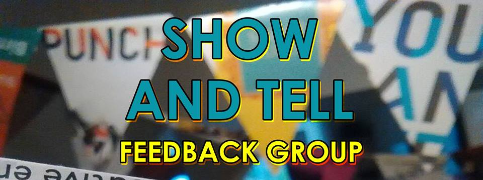

**Show and Tell is a monthly artists meetup I organise at the [Artefact](http://artefactstirchley.co.uk) cafe (prev P Cafe) in Stirchly, Birmingham.**

It takes place on the second Thursday of the month at 3pm. It is very informal and all are welcome. 

**The next dates are:**

Thurs 13th April  
Thurs 11th May  
Thurs 8th June  
Thurs 13th July  
Thurs 10th August

and so on...

## So what is Show and Tell? 

**Making art is weird.** You have total freedom to do anything you like, but that freedom can be paralysing, especially if you’re making work that’s completely original. How do you know if you’re on the right track? Are you wasting your time? Should you just give up and get a proper job? 

Show and Tell is a monthly meet-up for artists and anyone working on a personal or non-commercial creative project to talk about their work in progress and get valuable feedback.

Sometimes just explaining it to strangers can help you find the clarity and focus to move on, and seeing what likeminded people are working on and struggling with can be inspirational and reassuring.

Show and Tell is very informal. You don't have to prepare a presentation or endure a critique. Just sit in the circle show us what you're doing and talk about any problems for a couple of minutes. The only condition is you listen to everyone else!

After the showing and telling, which should last half an hour, we’ll break for drinks and feedback with people who caught your attention.

And that's it!

Show and Tell is a new thing and will evolve based on what artists in Stirchley actually need. It is organised by [Pete Ashton](http://art.peteashton.com) so if you have any questions, email pete@peteashton.com